# ChatBox
Whatsapp Clone using firebase

# About
This is a whatsapp clone built using android studio and firebase database, with combined features of the whatsapp and facebook.

# App Feautures
- Login/Register using Email or Phone
- Chat one-to-one
- Group chat
- find and send request to users
- Accept/Decline request
- Online & Last seen 
- Set profile picture and status

# Screenshots
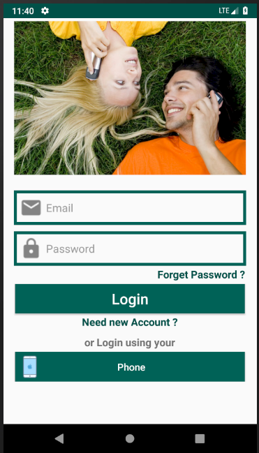 | 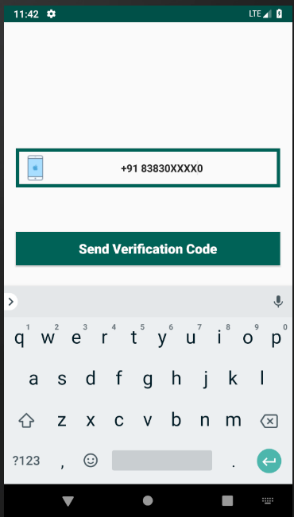
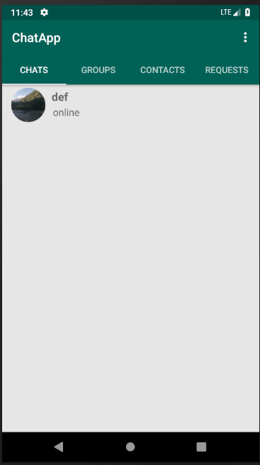
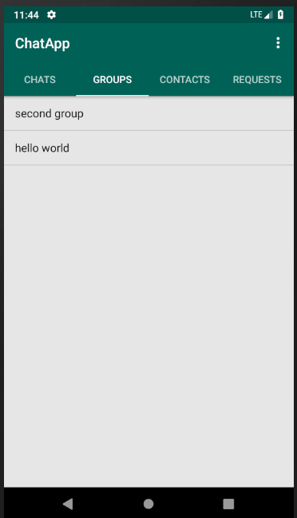
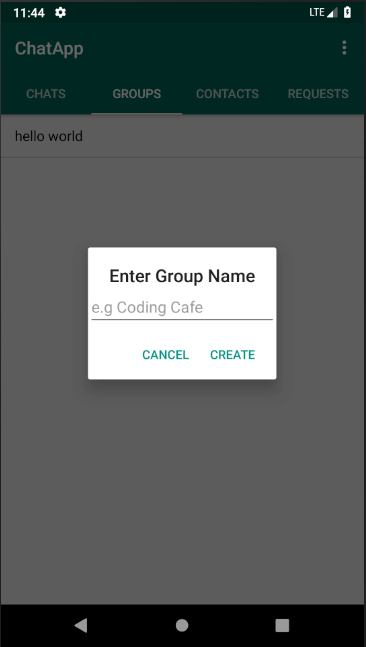
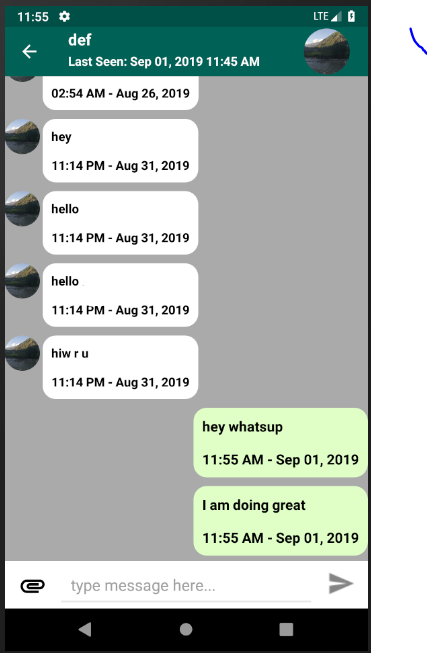
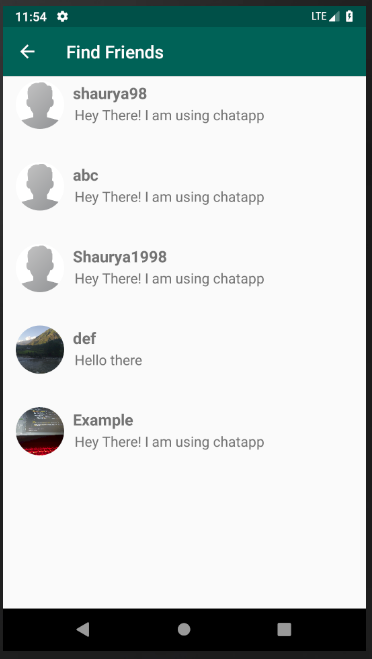
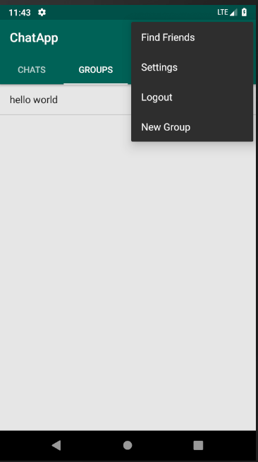
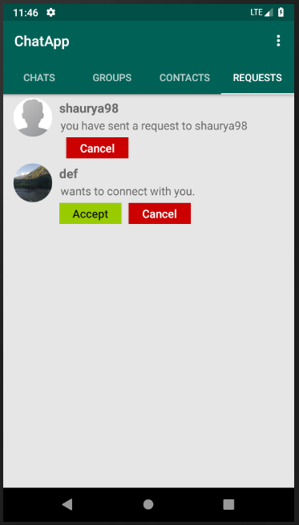
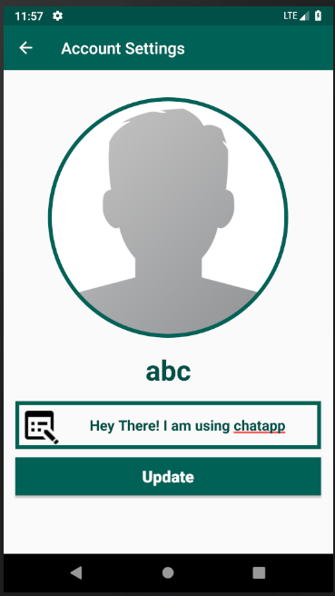
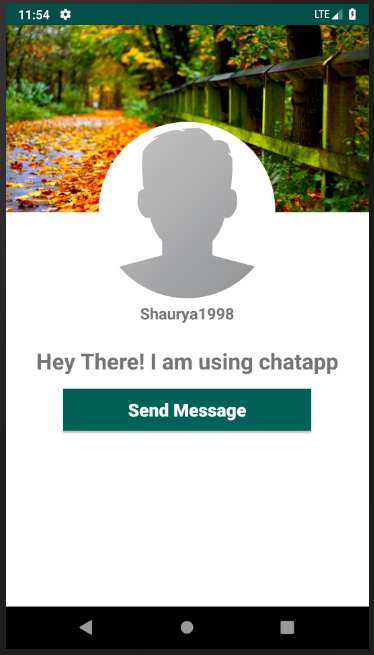
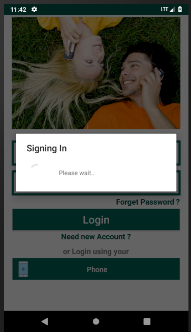
